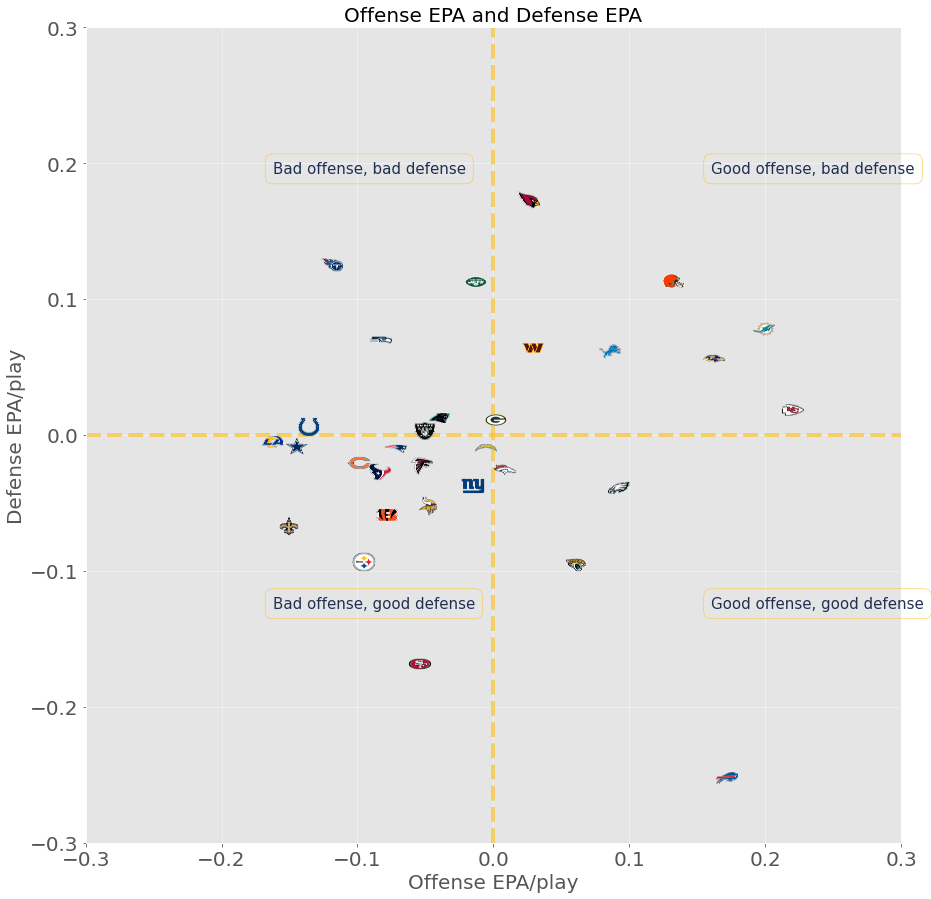
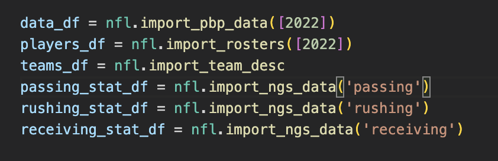
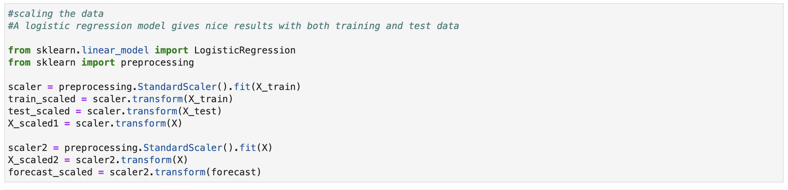
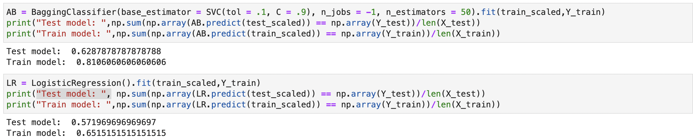
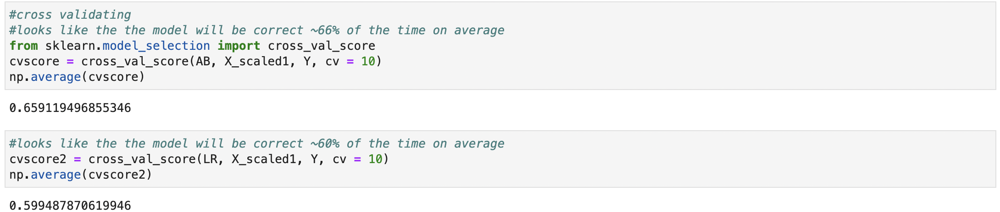
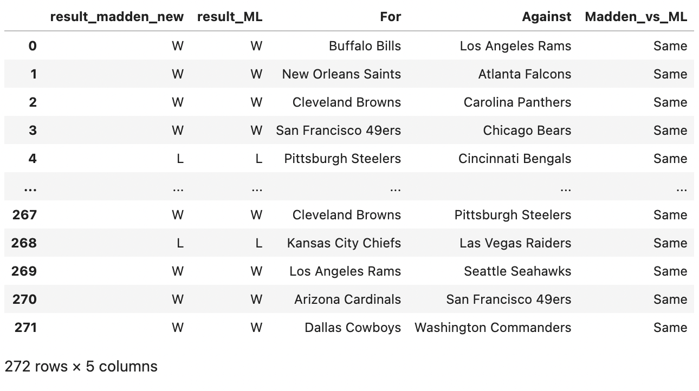
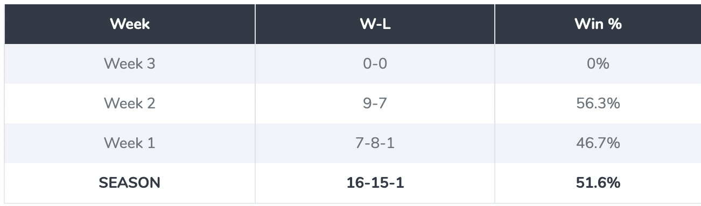

# Using NFL Data to make predictions

## A look at how EPA (Estimated Points Added) can be utilized to predict
game outcomes.

Play-by-play data for 2022 season as data source
- Python used for general data processing
- ML algorithms used to make predictions
  - Logistic Regression
  - Bagging Classifier

 The class presentation is located here **File:** [Presentation of the EPA and ML Presentation](./SMU Team #2.pdf)

## Table of Contents
1. [nfl-data-py](#1-nfl-data-py)

2. [Imported the following datasets to establish average EPA/play CLI](#2-We-also-imported-the-following-datasets-to-establish-average-EPA/play)

3. [Accuracy.](#3-Simulation-Trajectories)

4. [What's Next.](#4-What's-Next)

---

## 1. nfl-data-py

- nfl_data_py is a Python library for interacting with NFL data sourced from nflfastR, nfldata, dynastyprocess, and Draft Scout.

- Includes import functions for play-by-play data, weekly data, seasonal data, rosters, win totals, scoring lines, officials, draft picks, draft pick values, schedules, team descriptive info, combine results and id mappings across various sites.
    
  

## 2. We-also-imported-the-following-datasets-to-establish-average-EPA/play

* The output python script is located here **File:** [ML prediction with epa](./offense_defense_epa.ipynb)

 
 
* API used on this project are as follows
   * `pandas`
   * `matplotlib`
   * `numpy`
   * `scipy`
   * `seaborn` 
   * `nfl_data_py` 
   * `datetime` 
   * `sklearn.model_selection` `cross_val_score`
   * `sklearn.linear_model`  `LogisticRegression`

## 3. Accuracy 

The model was approximately 65.9% accurate and can definitely be improved. We believe the model may be more useful as a pre-game win probability model.

* The output python script is located here **File:** [Output per game](./2022overallpredictions1.csv)

* API used on this project are as follows
   * `pandas`
   * `numpy`
   * `pathlib`
   * `sklearn.model_selection` `train_test_split`
   * `pickle`

---

---

## 4. What's Next

We'd like to add EPA adjusted for opponent and also investigate how WP influences EPA predictability, as it's an intriguing topic with potential usefulness. Trying out other elements besides EPA could also be beneficial. Turnover rates, duration of possession, average number of plays run, average starting field position, special teams performance, QB specific play, and so on could all be valuable indicators. We found in the feature importance visualization that passing EPA per play had the strongest predictive power for a home team win and an away team win. Exploring QB specific features could help improve the model. Of course, that would require roster data for each week.

## Contributors
Michael Morton, Jarrett Lidell, Daniel Boyne, and Severo Fernandez
